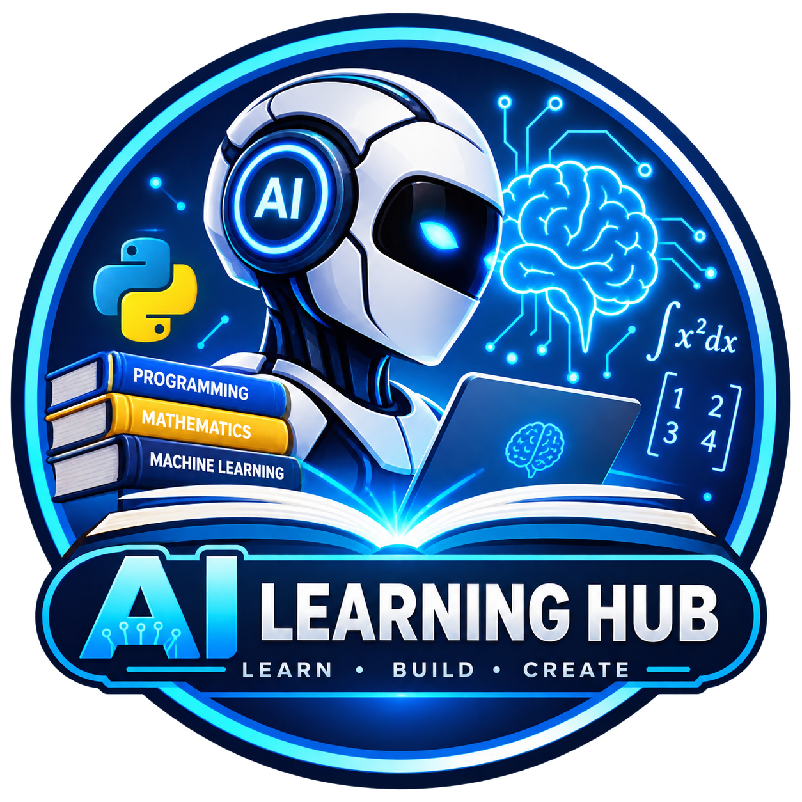

---
# 🤖 AI Learning Hub — Mini Task 2 Blog Website

Welcome to the AI Learning Hub! The website serves as an educational blog that demystifies AI, ML, and Math concepts by making them understandable for high school students.

🔗 Live Website: https://jariusvladymir-cmd.github.io/Mini-task-2-blog-website/

## 📌 Project Overview ##

This blog serves as an educational introduction that connects high school concepts such as python, calculus, probability, linear algebra, to real-world AI applications.

👤 Author Details
* Author: Jarius Vladymir M. De Leon
* Grade & Section: Grade 11 - Caballero
* Strand: STEM (Science, Technology, Engineering, and Mathematics)
* Email: jariusvladymir@gmail.com
* Release Date: August 30, 2026

📚 Blog Content Outline
* What is AI? – Introduction to AI and common examples of AI.
* Key Concepts – Workflow explanation: Data -> Training -> Model -> Prediction.
* Programming Basics (Python) – Basic programming in python.
* Math Behind AI – Math concepts used in AI:
  * Linear Algebra (Vectors and Matrices)
  * Probability & Statistics (Model confidence and distribution of data)
  * Calculus (Derivatives and Gradient Descent)
* Machine Learning – Supervised, Unsupervised, and Reinforcement Learning
* Deep Learning – Artificial Neural Networks and Generative AI.
* State-of-the-Art AI & Frameworks – Introduction to PyTorch, TensorFlow, Keras, and current AI challenges.
* Real World Applications – Applications in Healthcare, Transportation, Gaming, Smartphones, Finance, Agriculture, and Education.
* Conclusion – Recommended learning path for newbies in AI.

✨ Features

* Interactive Table of Contents: Easy navigation through blog sections.
* Social Sharing: One click sharing of the post via Twitter/X, Facebook, LinkedIn and "Copy Link" utility.
* Curated Learning Resources: Links in sidebar to quality free university courses from MIT, Harvard, Stanford and University of Helsinki (e.g., CS50, Elements of AI, MIT OCW).
* Responsive Design: Optimized readability for mobile, tablet and desktop screens.
* Math Formulas (LaTeX): Pretty formatting of mathematical equations and matrices.

🛠️ Technologies Used
* HTML5 – Semantic structure
* CSS3 – Styling and responsiveness
* JavaScript – Social sharing and dynamic interactions
* GitHub Pages – Free web hosting from repository

🚀 How to Run Locally
For local running or viewing the website on your own computer, please follow these steps:

* Clone the repository:
git clone https://github.com/jariusvladymir-cmd/Mini-task-2-blog-website.git

* Move inside the directory:
cd Mini-task-2-blog-website

* View the index.html file using any modern web browser or VS Code Live Server extension.

📄 Credits & Acknowledgments

I would like to give special thanks to the online education platforms for their great free university courses which were used in this blog:
* Harvard University (CS50 Series)
* Massachusetts Institute of Technology (MIT OCW)
* Stanford University (CS221, CS229, CS231n, CS224n)
* University of Helsinki (Elements of AI)

 © 2026 AI Learning Hub by Jarius Vladymir M. De Leon
---
⚠️ Notice

(This blog website was vibe-coded using Gemini 3.6 Flash with careful planning, drafting, and writing.)
